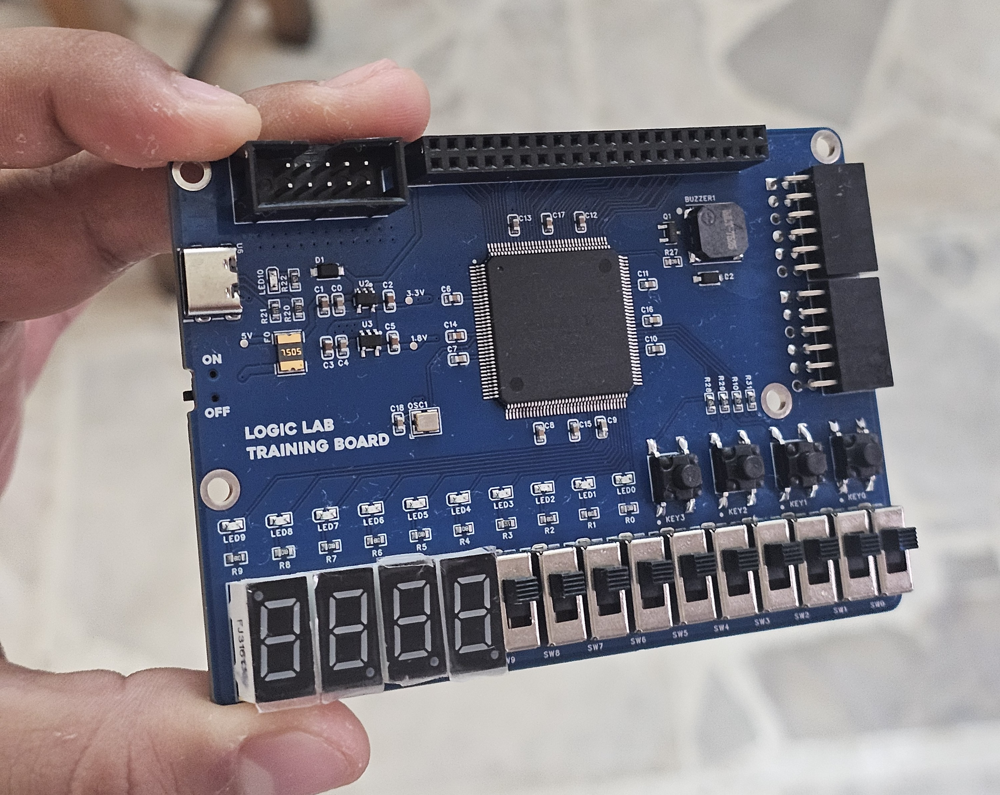
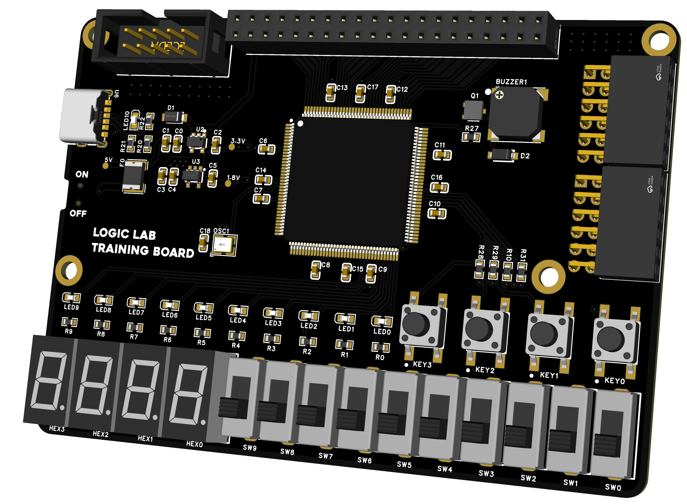
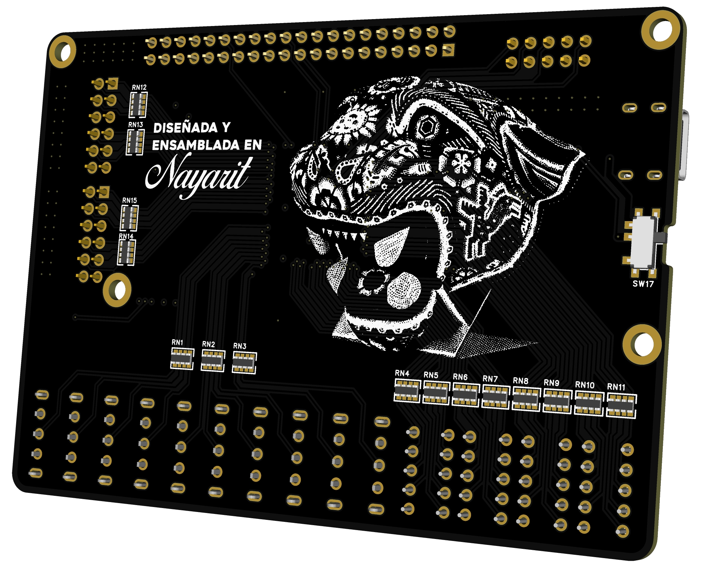
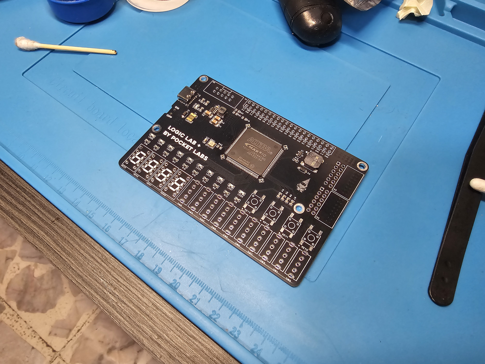
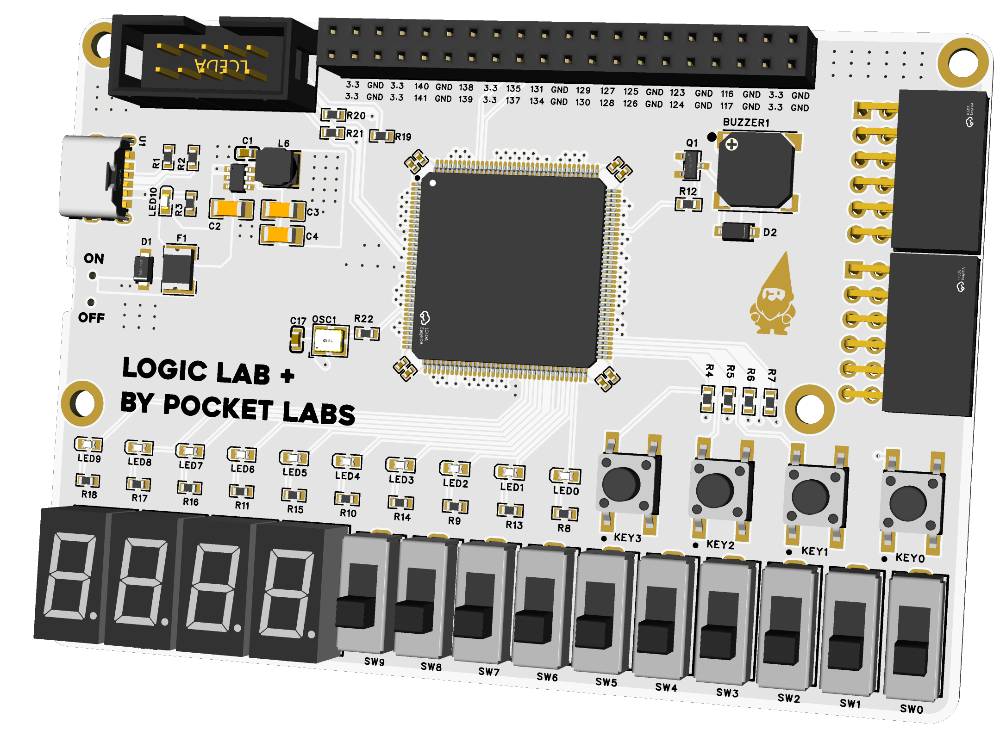
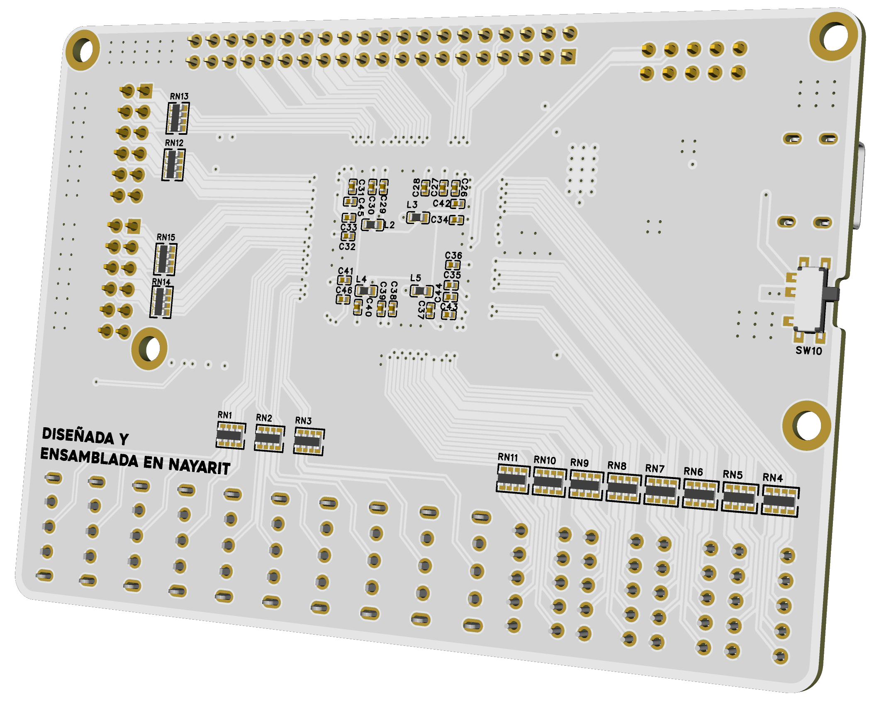

# Logic Lab FPGA

<p align="center">
  
</p>

Open-source FPGA educational platforms designed to provide affordable and accessible hardware for learning digital design fundamentals.

The Logic Lab boards were created to address the limited availability and high cost of FPGA development boards for students in Nayarit, Mexico. Both platforms focus on practical experimentation, beginner-friendly peripherals, and simplified hardware interaction.

Designed and assembled in Nayarit, Mexico.

---

# Logic Lab MAX V

Educational FPGA platform based on the Intel MAX V family.

## Overview

The Logic Lab MAX V was designed as an affordable entry-level FPGA platform focused on learning digital design fundamentals through direct hardware interaction.

<p align="center">
  
</p>

## Front Render

<p align="center">
  
</p>

## Back Render

<p align="center">
  
</p>

## Specifications

- FPGA: Altera MAX V 5M240ZT144C5N
- 10 LEDs
- 10 switches
- 4 push buttons
- 4 independent seven-segment displays
- Passive buzzer
- 2 PMOD-compatible connectors
- 50 MHz CMOS oscillator
- USB-C power input
- External USB-Blaster programming header
- Dual LDO power architecture
- USB TVS protection
- Resettable PTC fuse
- 3.3V GPIO logic
- 4-layer PCB

---

# Logic Lab MAX 10

Enhanced FPGA educational platform based on the Intel MAX 10 family.

## Overview

The Logic Lab MAX 10 extends the original Logic Lab concept with a larger FPGA, simplified single-supply configuration, and improved expansion capabilities while preserving the educational-oriented design philosophy.

<p align="center">
  
</p>

## Front Render

<p align="center">
  
</p>

## Back Render

<p align="center">
  
</p>

## Specifications

- FPGA: Altera MAX 10 10M02SCE144C8G
- 10 LEDs
- 10 switches
- 4 push buttons
- 4 independent seven-segment displays
- Passive buzzer
- 2 PMOD-compatible connectors
- 50 MHz CMOS oscillator
- USB-C power input
- External USB-Blaster programming header
- Single-supply FPGA configuration
- Buck regulator power architecture
- USB TVS protection
- Resettable PTC fuse
- 3.3V GPIO logic
- 4-layer PCB

---

# Design Goals

- Affordable FPGA experimentation platform
- Hands-on digital logic learning
- Beginner-friendly peripheral integration
- Open-source educational hardware
- Simple bring-up and accessibility
- Reduced dependency on external modules

These boards are intentionally focused on learning digital design fundamentals rather than running large soft-core processors or high-resource IP cores.

---

# Hardware Overview

## PCB Stackup

Both boards use a 4-layer PCB stackup:

1. Signal
2. Ground
3. Power
4. Signal

FR4 board with approximately 1.6 mm thickness in total.

## GPIO

- 3.3V logic levels
- No onboard level shifting

## Programming

Boards are programmed using an external USB-Blaster through the onboard 2x5 JTAG header.

---

# Repository Structure

```text
logic-lab-fpga/
│
├── boards/
│   ├── logic-lab-max-v/
│   └── logic-lab-max-10/
│
├── docs/
├── examples/
└── LICENSE